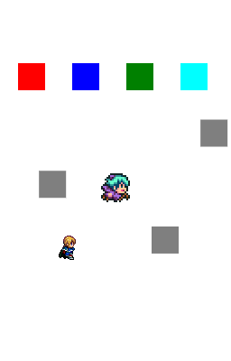

キャラクタ制御クラスとサンプル
==============================

概要
----

- キャラクタの生成（`prj/lib/CharFactory.ts`）
- キャラクタの制御（`prj/lib/CharEntity.ts`）
- 上記の動作確認（`prj/02.lib_char_object/src/main.ts`）

使い方
------

### 起動

```sh
npm run debug # access to http://localhost:3000
```

### 画面



<dl>
  <dt style="color:red">■ Direction</dt>
  <dd>向きを変える</dd>
  <dt style="color:blue">■ Action</dt>
  <dd>アクションを切り替える</dd>
  <dt style="color:green">■ Mental</dt>
  <dd>エフェクトを切り替える</dd>
  <dt style="color:cyan">■ Damage</dt>
  <dd>ダメージ状態（点滅）</dd>
  <dt style="color:gray">■ Collision</dt>
  <dd>当たり判定確認要（ドラッグ可能）</dd>
  <dt>上下に揺れるキャラクタ</dt>
  <dd>公式のサンプル（削除してないだけ）</dd>
  <dt>マントを着けたキャラクタ</dt>
  <dd>生成したキャラクタ</dd>
</dl>

詳細
----

### キャラクタの生成（`prj/lib/CharFactory.ts`）

```ts
/**
 * 前提：アセットが読み込まれていること
 * - エフェクト用画像：/assets/image/obj/effects.png
 * - キャラクタ設定json：/assets/data/char_sprite_settings.json
 *   （prj/01.collision_editor で作成した設定json）
 */
const scene = new g.Scene({
  game: g.game,
  assetPaths: ["/assets/**/*"]
});
```
```ts
/**
 * 適切にアセットが読み込まれていれば、名前を指定してインスタンスが取得できる
 */
const hero:CharEntity = CharFactory.getCharObject("hero");
```

### キャラクタの制御（`prj/lib/CharEntity.ts`）

```ts
// CharFactory 参照
const hero:CharEntity = CharFactory.getCharObject("hero");
```
```ts
// キャラクタのアニメーションなどを指定する
hero.setDirection("left");
hero.setAction("walk");
hero.setMental("sleep");
hero.setDamage();
// 移動は他のエンティティと同様
hero.x += 10;
hero.modified();
```
```ts
// 当たり判定のサンプルコード
const hit = g.Collision.intersectEntities(rect, hero.getHitArea());
rect.cssColor = hit ? "yellow" : "black";
rect.modified();
```

### 上記の動作確認（`prj/02.lib_char_object/src/main.ts`）

[画面](#画面)参照