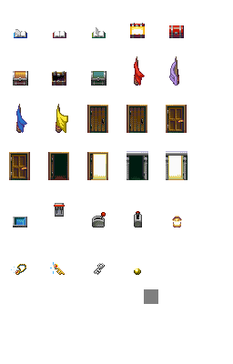

オブジェクト制御クラスとサンプル
================================

概要
----

- オブジェクトの生成（`prj/lib/ObjectFactory.ts`）
- オブジェクトの制御（`prj/lib/ObjectEntity.ts`）
- 上記の動作確認（`prj/03.lib_object_object/src/main.ts`）


使い方
------

### 起動

```sh
npm run debug # access to http://localhost:3000
```

### 画面




<dl>
  <dt>オブジェクトをクリック</dt>
  <dd>
    アニメーション切り替え
    （全パターンでローテーション）
  </dd>
  <dt style="color:gray">■ Collision</dt>
  <dd>当たり判定確認要（ドラッグ可能）</dd>
</dl>


詳細
----

### キャラクタの生成（`prj/lib/ObjectFactory.ts`）

```ts
/**
 * 前提：アセットが読み込まれていること
 * 
 * - 各種画像：/assets/image/obj/
 *   - book: /assets/image/obj/books.png 
 *   - chest: /assets/image/obj/chests.png
 *   - flag: /assets/image/obj/flags.png
 *   - door: /assets/image/obj/doors.png
 *   - switch: /assets/image/obj/switches.png
 *   - treasure: /assets/image/obj/treasures.png
 */
const scene = new g.Scene({
  game: g.game,
  assetPaths: ["/assets/**/*"]
});
```
```ts
/**
 * 適切にアセットが読み込まれていれば、名前を指定してインスタンスが取得できる
 * 名前は`object_settings`（`ObjectEntity.ts`内）を参照
 */
const obj = ObjectFactory.getObjectObject("blue_book");
```

### キャラクタの制御（`prj/lib/ObjectEntity.ts`）

```ts
// ObjectFactory 参照
const obj = ObjectFactory.getObjectObject("blue_book");
```
```ts
// オブジェクトのアニメーションなどを指定する
obj.setAction("flip");
```
```ts
// 当たり判定のサンプルコード
const hit = g.Collision.intersectEntities(rect, obj.getHitArea());
rect.cssColor = hit ? "yellow" : "black";
rect.modified();
```

### 上記の動作確認（`prj/03.lib_object_object/src/main.ts`）

[画面](#画面)参照