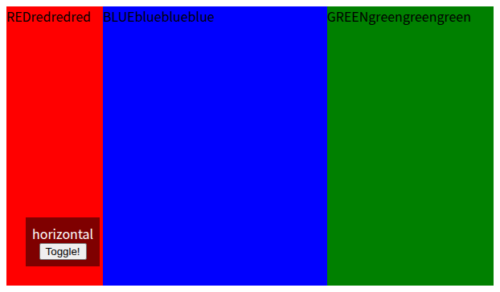

Flexレイアウトだけを提供するCSS
===============================

概要
----

- CSSは面倒くさい
- いい感じのCSSフレームワークを使って楽したい
  - [Bulma](https://bulma.io/)
  - [Beer CSS](https://www.beercss.com/)
- FWのグリッドシステムがそれぞれ違う（仕方ないけど
  - 「余白」が邪魔でツール的な画面のレイアウトに苦労する
- レイアウトシステムだけ提供する、とにかくシンプルなものが欲しい
  - 作ってみました

画面
----

- [index.html](index.html)



使い方
------

### import
```html
<!-- ローカル -->
<link rel="stylesheet" href="justflex.css"></link>
<!-- CDN（jsDelivr） -->
<link rel="stylesheet" href="https://cdn.jsdelivr.net/gh/yamahei/akashic_project@latest/prj/05.flexbox_css/justflex.css"></link>
```

### FlexBox Container

属性を付与すると、`display: flex`のスタイルが適用される。

- 水平方向：`horizontal-flex-container`（`flex-direction: row;`）

```html
<div horizontal-flex-container>
    <!-- 直下の要素をFlexBox Itemとして扱う -->
</div>
```

- 垂直方向：`vertical-flex-container`（`flex-direction: column;`）

```html
<div vertical-flex-container>
    <!-- 直下の要素をFlexBox Itemとして扱う -->
</div>
```
- エイリアス

```html
<div justflex-h>...</div>
<div justflex-v>...</div>
```

### FlexBox Item

何も指定しなくても、`FlexBox Container`直下の要素は`FlexBox Item`として扱う。

```html
<div />
```

`strech-flex-item`属性を指定すると`flex-grow: 1; flex-shrink: 1;`が適用される。

```html
<div strech-flex-item />
```

属性値を指定すると、`flex-grow`と`flex-shrink`にその値が適用される。

```html
<div strech-flex-item="0.2" />
```

エイリアス
```html
<div just-strech />
```