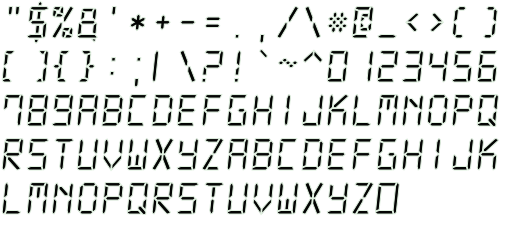
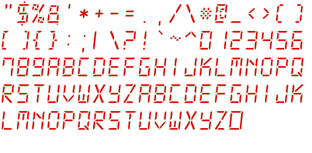

デジタル表示のBitmapFontとデジタル時計のクラス
==============================================

デジタル時計のクラス
--------------------

### 概要

- 任意のBitmapFontを指定して、時計を生成する
  - 等幅フォントを使うと幅が固定できて見栄えが良い
- 実体は`E`クラス内に`Label`を配置
  - フォントサイズはBitmapFontのサイズを指定するのが美しい
- X分ごと、Y秒前からカウントダウンする
  - 細かい設定は`DigitalWatchParameter`参照

### サンプルの起動方法

```sh
npm run debug # access to http://localhost:3000
```
- 5分ごと、10秒前からカウントダウンする設定

### 時計インスタンスの生成方法

```ts
//インポート例
import { DigitalWatch, DigitalWatchParameter } from "../lib/DigitalWatch";

//アセット読み込み例
function main(param: g.GameMainParameterObject): void {
	const scene = new g.Scene({
		game: g.game,
		assetPaths: [
			"/assets/font/digital-7.monoitalic.size48.black.bitmapfont.png",
			"/assets/font/digital-7.monoitalic.size48.black.bitmapfont_glyphs.json",
			"/assets/font/digital-7.monoitalic.size48.red.bitmapfont.png",
			"/assets/font/digital-7.monoitalic.size48.red.bitmapfont_glyphs.json",
		],
	});
    //後略
}

//インスタンス生成、シーンに追加の例
const param:DigitalWatchParameter = {
    EParam: {scene: scene},
    foreFont: "/assets/font/digital-7.monoitalic.size48.black.bitmapfont.png",
    foreGlyph: "/assets/font/digital-7.monoitalic.size48.black.bitmapfont_glyphs.json",
    backFont: "/assets/font/digital-7.monoitalic.size48.red.bitmapfont.png",
    backGlyph: "/assets/font/digital-7.monoitalic.size48.red.bitmapfont_glyphs.json",
    fontSize: 48,
    countdownStepMinute: 5,
    countdownSecond: 10,
}
const watch = new DigitalWatch(param);
scene.append(watch);
```

BitmapFontの作り方
------------------

### Akashic Engine 公式ツール

- [bmpfont-generator の仕様](https://akashic-games.github.io/reference/tool/bmpfont-generator.html)

> bmpfont-generator は以下のコマンドでインストールすることができます。
> ```bash
> npm install -g @akashic/bmpfont-generator
> ```

<details>
<summary>インストール中にエラーが出た。</summary>
Copilotに聞いたら、ローカルビルドに必要なライブラリが足りないとのこと。
以下のコマンドでインストールするってコトまで教えてくれた。

```sh
sudo apt update
sudo apt install -y build-essential libcairo2-dev libpango1.0-dev libjpeg-dev libgif-dev librsvg2-dev pkg-config libpixman-1-dev
```

インストール後に再実行したらうまく行った。
</details>

### フォント探し

- [DS-Digital](https://www.dafont.com/ds-digital.font): 没
- [7セグ・14セグフォント 「DSEG」](https://www.keshikan.net/fonts.html): 没
- [Digital-7 Font Family](https://www.1001fonts.com/digital-7-font.html): 採用


### 生成コマンドの記録

```sh
CHARS='"$%&'\''*+-=.,/\#@_<>()[]{}:;|\?!`~^0123456789ABCDEFGHIJKLMNOPQRSTUVWXYZabcdefghijklmnopqrstuvwxyz'
HEIGHT=48
FONT=./digital-7.monoitalic.ttf
COLOR1='#040504'
OUTPUT1=digital-7.monoitalic.size48.black.bitmapfont.png
COLOR2='#E00504'
OUTPUT2=digital-7.monoitalic.size48.red.bitmapfont.png
STROKE='#E0F0E0'
# Generate
bmpfont-generator -c "${CHARS}" -H ${HEIGHT} -F ${COLOR1} -S ${STROKE} ${FONT} ${OUTPUT1}
bmpfont-generator -c "${CHARS}" -H ${HEIGHT} -F ${COLOR2} -S ${STROKE} ${FONT} ${OUTPUT2}
```



