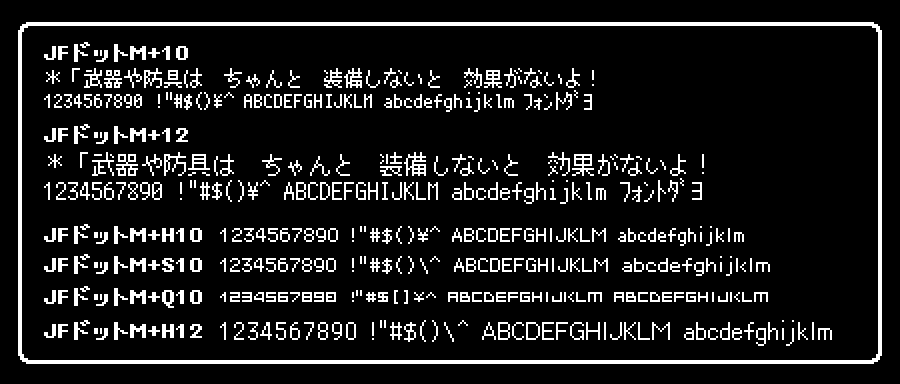

メッセージボックス（改行、送り機能付き）クラス
==============================================

概要
----

ゲームで使うメッセージボックスのクラスを作る

- ありがちな機能は押さえたい
  - 外枠あり
  - 長い文字は自動で改行
  - 枠いっぱいになったら停止（クリックで進める）
- フォントは選択可能にしたい
- [akashic-label](https://github.com/akashic-games/akashic-label)を使う

仕様/使い方
-----------


事前の準備
----------

### akashic-label のインストール

```sh
akashic install @akashic-extension/akashic-label
```

### 良さげなフォント

- [自家製ドットフォントシリーズ](http://jikasei.me/font/jf-dotfont/)
  - JFドットM+10（`JF-Dot-MPlus10.ttf`）



> JFドットM+10 … JIS X 0208：1990 対応、等幅 (太字あり)

`JIS X 0208：1990`は「JIS第1第2水準漢字」とほぼ同義（「[JIS X 0208 | Wikipedia](https://ja.wikipedia.org/wiki/JIS_X_0208)」）

### 外部フォントをAkashic Engineで使う方法

- [ニコ生ゲーにフォントを埋め込んでお洒落にする](https://isobe-yaki.hateblo.jp/entry/2023/05/15/024253)

#### ① `game.json`にフォントファイルを追加する
```json
{
  //前略
	"assets": {
    //前略
		"JF-Dot-MPlus10.ttf": {//追加
			"type": "text",
			"path": "assets/font/jfdotfont/JF-Dot-MPlus10.ttf",
			"global": true
		}
    //後略
	},
  //後略
}
```

#### ② FontFaceを登録する

Akashic Engine外のブラウザ世界にアクセスする（※）ために、`dom`を追加しないとエラーが出ちゃうので、`tsconfig.json`を編集する。
※`document`,`fetch`あたりのこと。

```json
//前略
"lib": [
  "es5",
  "dom"//これを追加
],
//後略
```

型定義も入れる必要あり？

```sh
npm install -g @types/node
```

登録コードはこんな感じ。
- なぜか`document.fonts.add`がTSエラーになるので`@ts-ignore`で抑止する。
- （自前で`fetch`するため）`scene`のコンストラクタ引数`assetPaths`には書かなくて良い。

```ts
const assetConfig = g.game._assetManager.configuration;
const fontPath = assetConfig["JF-Dot-MPlus10.ttf"].path;
const fontFaceName = "MyFavoriteFont";

await fetch(fontPath)
.then(b => b.blob())
.then(blob => blob.arrayBuffer())
.then(buf => {
    new FontFace(fontFaceName, buf)
    .load()
    .then(font => {
        const faceSet:FontFaceSet = document.fonts;
        // fonts.addはあるのにエラーが出るので無視する
        // https://developer.mozilla.org/ja/docs/Web/API/FontFaceSet/add
        // @ts-ignore
        faceSet.add(font);
    });
});        
```

FontFaceが登録できたら後はいつもの通り。
`注意`
- Promiseの完了を待たないと適用されない！
- `fontFaceName`に変な記号が入るとエラーなく適用されない
  - `JFM+10`はダメだった
```ts
const font = new g.DynamicFont({
  game: g.game, fontFamily: fontFaceName, size: 10
});
const label = new g.Label({
  scene: scene, font: font, fontSize: 10, textColor: "blue",
  text: `コレが俺の[${fontFaceName}]だっ！`,
});
scene.append(label);
```