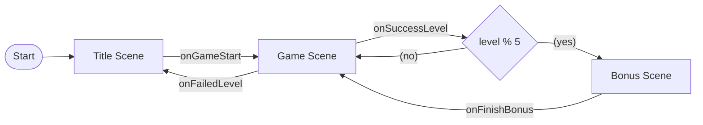

[game]宝箱当てゲーム＆ウォッチ
==============================

概要
----

- 時計付きのちょいゲームを作る
- 1発目なのでシンプルなものを
- 全体構成を固める

### 遊び方

- 5つの宝箱が並んでいる
  - 🎁 🎁 🎁 🎁 🎁
- 何回かシャッフルされる
  - 途中で中身を確認することもある
  - 難易度によって回数やパターンが変わる
- 正解するごとに難易度が上がっていく
  - 特に終わりはない
  - X回正解するごとにご褒美的なものを準備する

### 起動方法

```sh
npm run debug # access to http://localhost:3000
```

設計？構想？
------------

### ゲームコントローラ

エントリーポイント（`main`）の役割を明確にする。

- データ管理
  - レベル
- シーン管理
  - 各シーン生成
  - イベント拾ってシーンを切り替える

コレ以外は配下でやる。



### シーン

#### タイトル

- `onGameStart`
  - ゲーム開始時に発生する
  - ゲームシーンに差し替える（レベル=1）

#### ゲーム

- `onFailedLevel`
  - 不正解時に発生する
    （GAME OVER表示とかも終わってから）
  - タイトルシーンに差し替える
- `onSuccessLevel`
  - 正解時に発生する
    （CLEAR表示とかも終わってから）
  - 遷移先判定：
    - ゲームシーンに差し替える
      （新規インスタンス、level+=1）
    - ボーナスシーンに差し替える

#### ボーナス

- `onFinishBonus`
  - ボーナス終わりに発生する
  - ゲームシーンに差し替える
    （新規インスタンス、level+=1）

### レイヤー（`E`とか）


